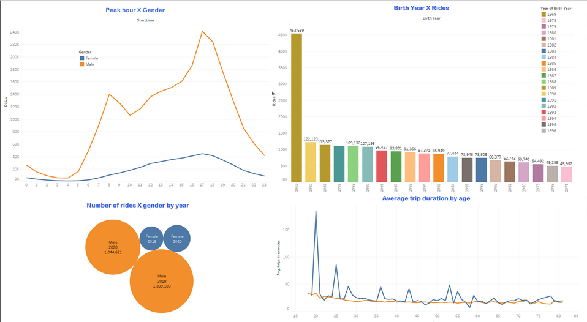

# Citi_Bike_Challenge
## General:
Citi Bike is the nation's largest bike share program, with 20,000 bikes and over 1,300 stations across Manhattan, Brooklyn, Queens, the Bronx and Jersey City. It was designed for quick trips with convenience in mind, and it’s a fun and affordable way to get around town.

## Bike share data analysis 
**Data source:**

link1: https://ride.citibikenyc.com/system-data
link2: https://s3.amazonaws.com/tripdata/index.html

## Summary:

I got data for June for the years 2019 to 2022 and cleaned it and format using python and pandas and save it on one file

## Tableau Work:

**Tableau file link:** https://public.tableau.com/app/profile/yousuf.amin.alfatwa/viz/Citi_Bike_challenge/Story1?publish=yes .

Screenshot from tableau file 

## Analyzing:
- from the study, we find that the number of subscribers is affected by Covid-19 and decreasd in 2020 then start to increase in 2021 and 2022 also putting electrical bikes in service effect the number of custumers in general.

