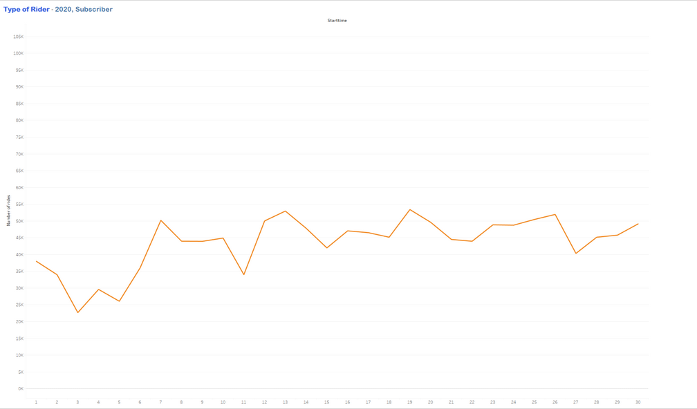
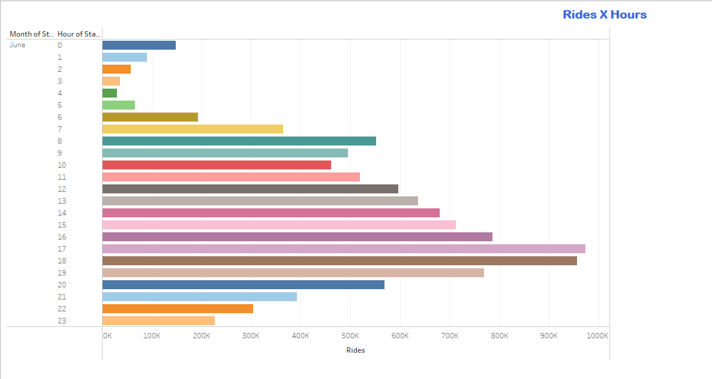

# Citi_Bike_Challenge
## General:
Citi Bike is the nation's largest bike share program, with 20,000 bikes and over 1,300 stations across Manhattan, Brooklyn, Queens, the Bronx and Jersey City. It was designed for quick trips with convenience in mind, and it’s a fun and affordable way to get around town.

## Bike share data analysis 
**Data source:**

link1: https://ride.citibikenyc.com/system-data
link2: https://s3.amazonaws.com/tripdata/index.html

## Summary:

I got data for June for the years 2019 to 2022 and cleaned it and format using python and pandas and save it in one file

## Tableau Work:

**Tableau file link:** https://public.tableau.com/app/profile/yousuf.amin.alfatwa/viz/Citi_Bike_challenge/Story1?publish=yes .

Screenshot from tableau file 

## Analyzing:

1- some of the questions I tried to answer by analyzing :
2- How many trips have been recorded in total during the chosen period?
3- What are the peak hours when bikes are used during chosen period?
4- What are the top 10 stations in the city for starting a journey?
5- How does the average trip duration change by age?
6- What is the average distance in miles for a bike trip?
7- Gender usage

Some Answers
- from the study, we find that the number of subscribers is affected by Covid-19 and decreases in 2020 then starts to increase in 2021 and 2022.
-Putting electrical bikes in service affects the number of customers in general.

- we find that the peak hours of bike use are  between 5 pm to 7 pm

